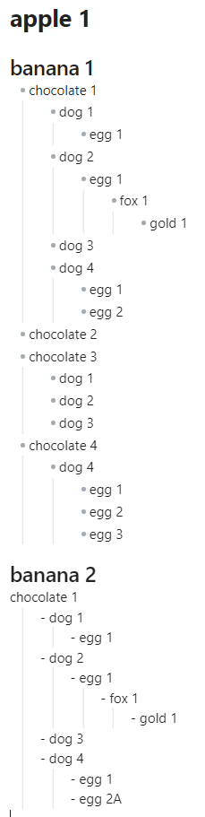
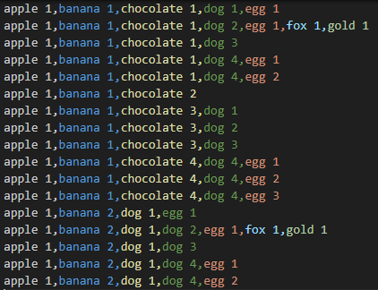

# Markmap to CSV

this plugin makes you easy to convert markmap to a csv file.
let's trying!

it can be read until heading 2.
under heading 2, you can use list!

[How to use this plugin](https://youtu.be/X7l4XTSrD0U)


## Example

- markdown input



- csv output



## How to use

1. write your markmap
```
# apple 1

## banana 1
- chocolate 1
    - dog 1
        - egg 1
    - dog 2
        - egg 1
	        - fox 1
		        - gold 1
    - dog 3
    - dog 4
	    - egg 1
	    - egg 2
- chocolate 2
- chocolate 3
    - dog 1
    - dog 2
    - dog 3
- chocolate 4
    - dog 4
        - egg 1
        - egg 2
        - egg 3
## banana 2
chocolate 1
    - dog 1
        - egg 1
    - dog 2
        - egg 1
	        - fox 1
		        - gold 1
    - dog 3
    - dog 4
	    - egg 1
	    - egg 2A

```

2. convert markmap to csv
- input `convert markmap to csv` using command palette
- use shortcut


# Other

you can use other plugin if you want to see markmap render.

https://github.com/MarkMindCkm/obsidian-markmind
